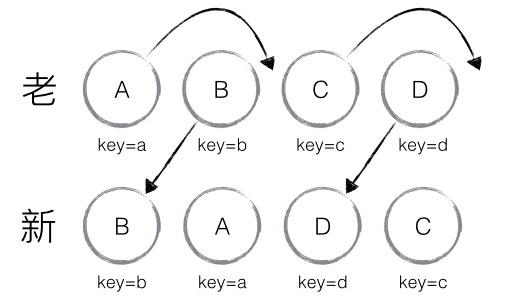

# Update-ctd

In the previous blog we mentioned `updateChildren()`.

```js
// MultiChild.js

_updateDOMChildren(prevProps, nextProps){
  const prevType = typeof prevProps.children
  const nextType = typeof nextProps.children
  assert(prevType === nextType)

  //No child, return
  if (nextType === 'undefined') return
  
  if (nextType === 'string' || nextType === 'number'){
    this._domNode.textContent = nextProps.children
  }else{
    this.updateChildren(nextProps.children)
  }
}
```

So let's get deeper. Before we ge into the `updateChildren()` in `DOMComponent.js`, we go into `updateChildren()` in `ChildReconciler.js` first.

```js
// ChildReconciler.js

function updateChildren(
  prevChildren, // instance tree
  nextChildren, // element tree
  mountNodes, removeNodes){
  const instantiateComponent = require('./instantiateComponent')
  Object.keys(nextChildren).forEach((childKey) => {
    const prevChildComponent = prevChildren[childKey]
    const prevElement = prevChildComponent && prevChildComponent._currentElement
    const nextElement = nextChildren[childKey]

    // three scenarios

    if (prevElement && shouldUpdateComponent(prevElement, nextElement)){
      Reconciler.receiveComponent(prevChildComponent, nextElement)
      nextChildren[childkey] = prevChildComponent
    }else{
      if (prevChildComponent){
        removeNodes[childKey] = prevChildComponent._domNode
        Reconciler.umountComponent(prevChildComponent)
      }
      const nextChildComponent = instantiateComponent(nextElement)
      nextChildren[childKey] = nextChildComponent
      mountNodes.push(Reconciler.mountComponent(nextChildComponent))
    }
  })

  Object.keys(prevChildren).forEach((childKey)=>{
    if (!nextChildren.hasOwnProperty(childKey)){
      const prevChildComponent = prevChildren[childKey]
      removeNodes[childKey] = prevChildComponent
      Reconciler.umountComponent(prevChildComponent)
    }
  })

}
```
This function log all nodes that need to be updated(mount or removed). Implicitly, it changes the new element tree into a component tree. There are three scenarios,

1. the previous element tree exists, and it is has the same time with the new one
2. the previous element tree exists, but not the same type
3. the previous element doesn't exists

We can see clearly the three cases reflect by codes.

After logging, we go into `updateChildren()` in the MultiChild.js.

```js
updateChildren(nextChildren){
  let prevRenderedChildren = this._renderedChildren
  let nextRenderedChildren = flattenChildren(nextChildren)
  
  let mountNodes = []
  let removedNodes = {}
  
  ChildReconciler.updateChildren(
    prevRenderedChildren,
    nextRenderedChildren,
    mountNodes,
    removedNodes
  )
  
  let updates = []
  let lastIndex = 0
  let nextMountIndex = 0
  let lastPlacedNode = null
  
  Object.keys(nextRenderedChildren).forEach((childKey, nextIndex) => {
    let prevChild = prevRenderedChildren[childKey]
    let nextChild = nextRenderedChildren[childKey]
    if (prevChild === nextChild) {
      if (prevChild._mountIndex < lastIndex) {
        updates.push(OPERATIONS.move(nextChild, lastPlacedNode))
      }

      lastIndex = Math.max(prevChild._mountIndex, lastIndex)
      prevChild._mountIndex = nextIndex
    } else {

      if (prevChild) {
        lastIndex = Math.max(prevChild._mountIndex, lastIndex)
      }
      nextChild._mountIndex = nextIndex
      updates.push(
        OPERATIONS.insert(
          mountNodes[nextMountIndex],
          lastPlacedNode
        )
      )
      nextMountIndex ++
    }
    lastPlacedNode = nextChild._domNode
  })

  Object.keys(removedNodes).forEach((childKey) =>  {
    updates.push(
      OPERATIONS.remove(removedNodes[childKey])
    )
  })
  
  processQueue(this._domNode, updates)

  this._renderedChildren = nextRenderedChildren
}
```
We analyze the code directly from the loop. This is also the place trick me most. Here what we do? We use an array `updates` to document update Operations, which are Move, Insert, and Remove. And after the loop we do actual updates based on the `updates`. Here we talk about the most tricky one -- Move:

Why we do move? If you have read Reconciliation you know that there are redundant operations if we don't do move. Here is the example (Thanks to [twobin])(https://zhuanlan.zhihu.com/p/20346379):



Old set is A,B,C,D. New set is B,A,D,C. Originially, without React, when doing diff algorithm, since the first one B != A, so it delete A and insert B, and so on, delete B, C, D and insert A, D, C. This cause redundance. React found this, and use Move to solve this problem.

How to solve this? On the same level, React use a key to differentiate each node. And when comparing new set of nodes and old set of nodes, it compare key Specifically, at first React foreach new set(for name in newChildren). If prevChild === nextChild, then judge if move -- it use `lastIndex` to track the max(right-most) position of the visited node. If child.mountIndex < lastIndex, then do Move. Or, do nothing. 

For example, the first one to be judged is B. Judge if keyB are same in both old and new sets. Same? Then the mountIndex of B(in old set) is 1, lastIndex is 0. prevChild.mountIndex > lastIndex, So No Move. Then we set lastIndex to be max(prevChild.mountIndex, lastIndex), which is 1. Finally nextIndex++.

The second one is A. The mountIndex of A is 0, and lastIndex is 1. prevChild.mountIndex < lastIndex So Move, and do`updates.push(OPERATIONS.move(nextChild, lastPlacedNode))`. Then update lastIndex, which is 1. And update the position of A, A.mountIndex = 1. Finally nextIndex++.

And So On.

Then we do actual node update in `processQueue`. And that is all about the what we are going to talk about.